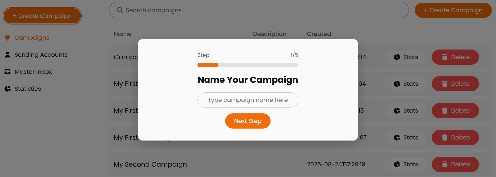
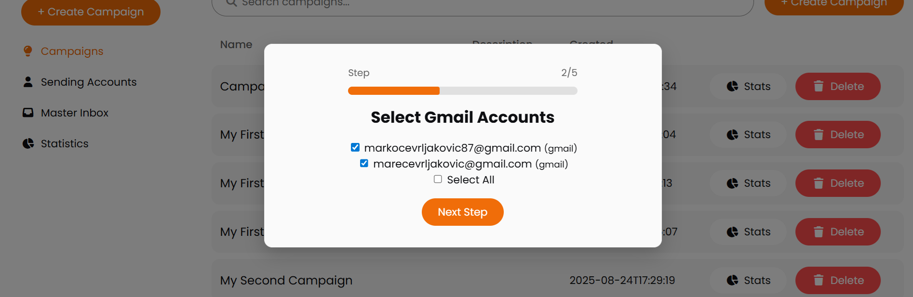
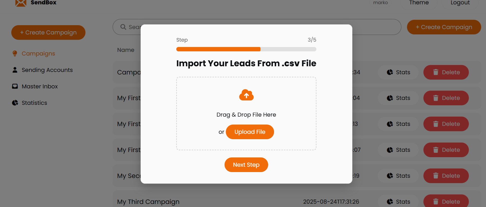
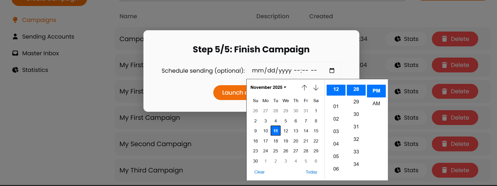
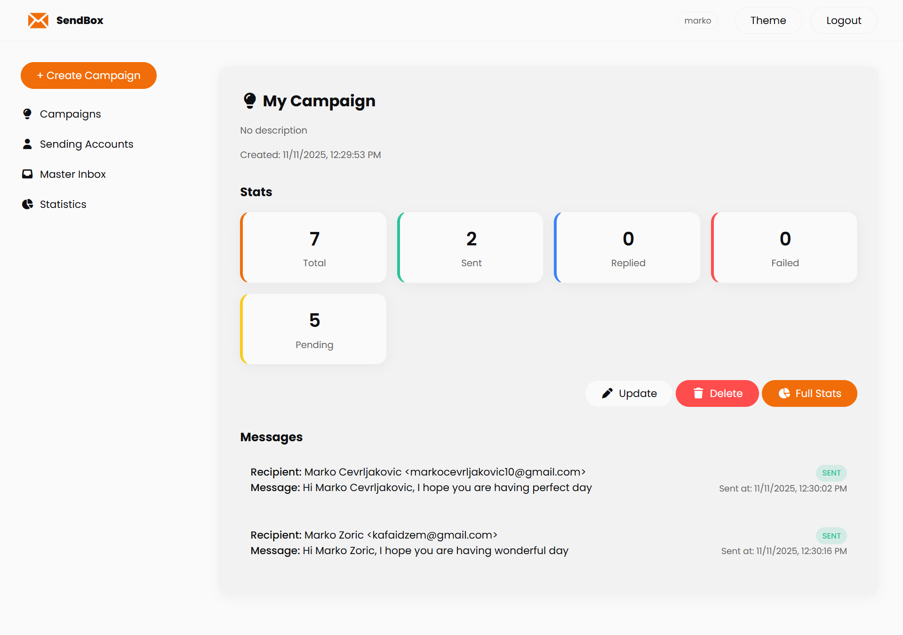
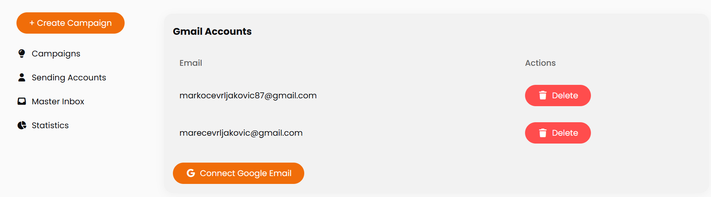
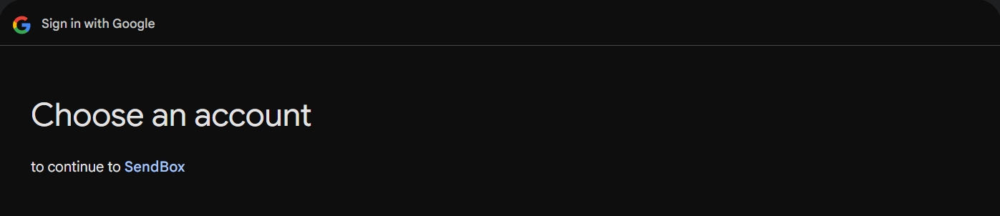

# Cold Email Automation Platform

A full-stack application for cold email automation campaigns. The platform allows user registration, SMTP account management, campaign and template creation, batch email sending with CSV imports, and automatic follow-up scheduling. It also supports Gmail OAuth2 integration for connecting personal or business inboxes.

---

## Tech Stack

- **Tools**: Built in Intellij using Java
- **Backend**: Spring Boot (Java 24), Spring Security, Jakarta Mail (Angus Mail), OAuth2
- **Database**: SQL
- **Frontend**: HTML, CSS, JavaScript (vanilla)
- **Deployment**: runnable locally or on a server/cloud

---

## Core Features

- User registration, login, email verification and password reset
- Management of multiple SMTP accounts (regular + Gmail OAuth2)
- Campaign and email template creation
- Batch email sending with CSV import
- Message status tracking: **PENDING, SENT, FAILED, REPLIED**
- Campaign analytics with statistics per campaign
- Automatic follow-ups based on defined delays
- Gmail inbox replies synced back into the system and linked to original campaigns

---

## API Overview

All endpoints follow a RESTful structure. Authentication is handled with JWT, except for login/register endpoints.

### Auth API
- `POST /auth/register` – Register new user
- `GET /auth/confirm` – Confirm email using token
- `POST /auth/login` – User login
- `POST /auth/refresh` – Refresh JWT token
- `POST /auth/me` – Get authenticated user

### User API
- `GET /users/{id}` – Get user by ID
- `POST /users/registerAdmin` – Register admin
- `PUT /users/{id}` – Update user
- `DELETE /users/{id}` – Delete user

### Campaign API
- `GET /campaigns` – Get all campaigns
- `GET /campaigns/{id}` – Get campaign by ID
- `GET /campaigns/{id}/stats` – Campaign statistics
- `GET /campaigns/{id}/replied` – Replied emails
- `POST /campaigns` – Create campaign
- `PUT /campaigns/{id}` – Update campaign
- `DELETE /campaigns/{id}` – Delete campaign

### Template API
- `GET /templates` – Get all templates
- `GET /templates/{id}` – Get template by ID
- `POST /templates` – Create template
- `PUT /templates/{id}` – Update template
- `DELETE /templates/{id}` – Delete template

### SMTP API
- `GET /smtp` – Get all SMTP accounts
- `GET /smtp/{id}` – Get one SMTP account
- `POST /smtp` – Add new SMTP account
- `PUT /smtp/{id}` – Update SMTP account
- `DELETE /smtp/{id}` – Delete SMTP account

### Gmail OAuth API
- `GET /oauth-url` – Generate Gmail OAuth2 URL
- `GET /callback` – OAuth callback
- `GET /gmail-smtp` – Get connected Gmail accounts
- `POST /gmail-smtp` – Connect Gmail account
- `DELETE /gmail-smtp/{id}` – Disconnect Gmail account

### Email Message API
- `GET /email-messages` – Get all messages
- `GET /email-messages/campaign/{campaignId}` – Get campaign messages
- `GET /email-messages/{id}` – Get one message
- `POST /email-messages/send-batch` – Send emails in batch
- `PUT /email-messages/{id}` – Update message
- `DELETE /email-messages/{id}` – Delete message

### Email Reply API
- `GET /reply` – Get all replies
- `GET /reply/{id}` – Get one reply
- `POST /reply/respond/{replyId}` – Reply to a reply
- `DELETE /reply/{id}` – Delete reply

### Follow-up API
- `GET /follow-ups` – Get all follow-ups
- `GET /follow-ups/{id}` – Get one follow-up
- `POST /follow-ups/campaign/{campaignId}` – Add follow-up to campaign
- `PUT /follow-ups/{id}` – Update follow-up
- `DELETE /follow-ups/{id}` – Delete follow-up

### Password Reset API
- `POST /password/forgot` – Request password reset
- `POST /password/reset` – Reset password

---

## SOLID Implementation

### Single Responsibility & Open/Closed Principle

This allows adding new senders (e.g., Mailgun, SendGrid, Outlook)  
without modifying existing business logic, following the Open/Closed Principle.

```java
public interface EmailSender {
    void sendEmails(EmailMessage emailMessage) throws MessagingException;
}
```
```java
public interface EmailConnectionService {
    void connect(OAuthTokens tokens, String senderEmail);
}
```
```java
public interface TokenService {
    OAuthTokens refreshAccessToken(String refreshToken);
}
```

### Liskov Substitution Principle and Interface Segregation Principle

Each email sender (e.g., Gmail, SendGrid) can be used interchangeably since they respect the same `EmailSender` contract,  
and the interfaces are small and focused (no unused methods).

```java
public class GmailSmtpSender implements EmailSender {
    /*...*/
    @Override
    public void sendEmails(EmailMessage email) throws MessagingException {
        /*...*/
    }
}
```

### Dependency Inversion Principle

Modules like `SendBatchEmailsService` depend on the `EmailSender` abstraction,  
not on concrete implementations. This makes the system flexible and easy to test.

```java
@Service
@RequiredArgsConstructor
public class SendBatchEmailsService {

    private final EmailSender emailSender; // depends on abstraction

    public void send(EmailMessage emailMessage) throws MessagingException {
        emailSender.sendEmails(emailMessage);
    }
}
```
```java
public interface EmailSender {
    void sendEmails(EmailMessage emailMessage) throws MessagingException;
}
```
```java
@Service
public class GmailSmtpSender implements EmailSender {
    @Override
    public void sendEmails(EmailMessage email) throws MessagingException {
        /*...*/
    }
}
```

## DRY Implemantation

SpintaxProcessor is used in both SendBatchEmailsService and FollowUpSchedulerService through the shared EmailPreparationService, which centralizes email text generation (spintax + personalization) and eliminates code duplication in accordance with the DRY principle.

### Resuing methods
The DRY (Don’t Repeat Yourself) principle is implemented by reusing code and avoiding duplication, each unit of reusable work is encapsulated in its own method.
```java
@Service
@RequiredArgsConstructor
public class EmailPreparationService {

    private final SpintaxProcessor spinTextProcessor;

    public String generateMessageText(String templateText, String recipientName) {
        String withName = templateText.replace("{{name}}", recipientName);
        return spinTextProcessor.process(withName);
    }
}
```

```java
private List<EmailMessage> prepareAndSaveEmails(EmailTemplate template, List<EmailRecipientDto> recipients){
    var messageText = preparationService.generateMessageText(template.getMessage(), recipient.getName());
}
```

### Using Generics

I used Generic classes to avoid repetition within basic CRUD operations that shares same logic

#### Generic class for CRUD service operations

```java
@Getter
public abstract class BaseService<
        E,
        D,
        C,
        R extends UserScopedRepository<E> & JpaRepository<E, Long>
        > {

    protected final R repository;
    protected final CurrentUserProvider currentUserProvider;
    private final Supplier<RuntimeException> notFound;

    protected BaseService(
            R repository,
            CurrentUserProvider currentUserProvider,
            Supplier<RuntimeException> notFound
    ) {
        this.repository = repository;
        this.currentUserProvider = currentUserProvider;
        this.notFound = notFound;
    }

    protected abstract D toDto(E entity);
    protected abstract E toEntity(C request);
    protected abstract void updateEntity(E entity, C request);

    /** every entity must have a user */
    protected abstract void setUser(E entity, User user);

    protected List<D> toListDto(List<E> entities) {
        return entities.stream()
                .map(this::toDto)
                .toList();
    }

    public List<D> getAll() {
        var user = currentUserProvider.getCurrentUser();
        return toListDto(repository.findAllByUserId(user.getId()));
    }

    public D getById(Long id) {
        var user = currentUserProvider.getCurrentUser();
        var entity = repository.findByIdAndUserId(id, user.getId())
                .orElseThrow(notFound);
        return toDto(entity);
    }

    public D create(C request) {
        var user = currentUserProvider.getCurrentUser();
        var entity = toEntity(request);
        setUser(entity, user);
        repository.save(entity);
        return toDto(entity);
    }

    public D update(Long id, C request) {
        var user = currentUserProvider.getCurrentUser();
        var entity = repository.findByIdAndUserId(id, user.getId())
                .orElseThrow(notFound);

        updateEntity(entity, request);
        repository.save(entity);

        return toDto(entity);
    }

    public void delete(Long id) {
        var user = currentUserProvider.getCurrentUser();
        var entity = repository.findByIdAndUserId(id, user.getId())
                .orElseThrow(notFound);

        repository.delete(entity);
    }
}
```

```java
@Service
public class EmailTemplateService extends BaseService<
        EmailTemplate,
        EmailTemplateDto,
        CreateTemplateRequest,
        TemplateRepository
        > {

    private final EmailTemplateMapper mapper;
    private final CampaignRepository campaignRepository;

    public EmailTemplateService(
            TemplateRepository repository,
            CurrentUserProvider currentUserProvider,
            EmailTemplateMapper mapper,
            CampaignRepository campaignRepository
    ) {
        super(
                repository,
                currentUserProvider,
                TemplateNotFoundException::new
        );
        this.mapper = mapper;
        this.campaignRepository = campaignRepository;
    }

    @Override
    protected EmailTemplateDto toDto(EmailTemplate entity) {
        return mapper.toDto(entity);
    }

    @Override
    protected EmailTemplate toEntity(CreateTemplateRequest req) {
        var user = currentUserProvider.getCurrentUser();
        var campaign = campaignRepository.findByIdAndUserId(req.getCampaignId(), user.getId())
                .orElseThrow(CampaignNotFoundException::new);

        var entity = mapper.toEntity(req);
        entity.setCampaign(campaign);
        return entity;
    }

    @Override
    protected void updateEntity(EmailTemplate entity, CreateTemplateRequest req) {
        var user = currentUserProvider.getCurrentUser();
        var campaign = campaignRepository.findByIdAndUserId(req.getCampaignId(), user.getId())
                .orElseThrow(CampaignNotFoundException::new);

        mapper.update(req, entity);
        entity.setCampaign(campaign);
    }

    @Override
    protected void setUser(EmailTemplate entity, User user) {
        entity.setUser(user);
    }
}
```

#### Generic Class for CRUD Controllers

```java
public abstract class BaseController<D, C> {

    protected final BaseService<?, D, C, ?> service;

    protected BaseController(BaseService<?, D, C, ?> service) {
        this.service = service;
    }

    @GetMapping
    public List<D> getAll() {
        return service.getAll();
    }

    @GetMapping("/{id}")
    public D getById(@PathVariable Long id) {
        return service.getById(id);
    }

    @PostMapping
    public D create(@RequestBody C request) {
        return service.create(request);
    }

    @PutMapping("/{id}")
    public D update(@PathVariable Long id, @RequestBody C request) {
        return service.update(id, request);
    }

    @DeleteMapping("/{id}")
    public void delete(@PathVariable Long id) {
        service.delete(id);
    }
}
```

```java
@RestController
@RequestMapping("templates")
public class EmailTemplateController extends BaseController<EmailTemplateDto, CreateTemplateRequest> {
    public EmailTemplateController(EmailTemplateService emailTemplateService) {
        super(emailTemplateService);
    }
}
```

#### UserScopeRepository for Security checkup

```java
public interface UserScopedRepository<E> {
    List<E> findAllByUserId(Long userId);
    Optional<E> findByIdAndUserId(Long id, Long userId);
}
```

```java
public interface TemplateRepository
        extends JpaRepository<EmailTemplate, Long>, UserScopedRepository<EmailTemplate> {
    List<EmailTemplate> findAllByUserId(Long userId);
    Optional<EmailTemplate> findByIdAndUserId(Long id, Long userId);
}
```


---

### Using email service for password recovery (Gmail SMTP)

```java
public void forgotPassword(ResetPasswordRequest request){
        var user = userRepository.findByEmail(request.getEmail()).orElseThrow(UserNotFoundException::new);
        String token = UUID.randomUUID().toString();

        PasswordResetToken resetToken = PasswordResetToken.builder()
                .token(token)
                .user(user)
                .createdAt(LocalDateTime.now())
                .expiresAt(LocalDateTime.now().plusMinutes(30))
                .build();

        passwordResetTokenRepository.save(resetToken);

        String link = appUrl + "/password/reset?token=" + token;
        notificationEmailService.sendEmail(request.getEmail(), subject, link);
}
```

### Using CSV parsing

```java
 private List<EmailRecipientDto> parseCsv(MultipartFile file)  {
        List<EmailRecipientDto> recipients = new ArrayList<>();

        try (BufferedReader reader = new BufferedReader(
                new InputStreamReader(file.getInputStream(), StandardCharsets.UTF_8))) {

            String line;
            boolean isFirst = true;

            while ((line = reader.readLine()) != null) {
                if (isFirst) {
                    isFirst = false;
                    continue;
                }

                String[] tokens = line.split(",");


                String email = tokens[0].trim();
                String name = tokens.length > 1 ? tokens[1].trim() : "";

                if (email.isEmpty()) continue;

                var dto = new EmailRecipientDto(name, email);
                recipients.add(dto);

            }

        } catch (IOException e) {
            throw new RuntimeException("Failed to read CSV file", e);
        }

        return recipients;

    }
```

#### Expected CSV format

| name | email |
| marko | marko@email.com |

### Using Spring Security

#### Password hashing using BCrypt algorithm

```java
@Configuration
public class PasswordConfig {
    @Bean
    public PasswordEncoder passwordEncoder() {
        return new BCryptPasswordEncoder();
    }
}
```

#### Gmail SMTP Access and Refresh token encryption

```java
@Component
public class TokenEncryptor {

    @Value("${spring.token.encrypt}")
    private String secretKey;

    private SecretKeySpec getKey() {
        byte[] decodedKey = Base64.getDecoder().decode(secretKey);
        return new SecretKeySpec(decodedKey, "AES");
    }

    public String encrypt(String data) {
        try {
            Cipher cipher = Cipher.getInstance("AES");
            cipher.init(Cipher.ENCRYPT_MODE, getKey());
            return Base64.getEncoder().encodeToString(cipher.doFinal(data.getBytes()));
        } catch (Exception e) {
            throw new RuntimeException("Encryption error", e);
        }
    }

    public String decrypt(String encrypted) {
        try {
            Cipher cipher = Cipher.getInstance("AES");
            cipher.init(Cipher.DECRYPT_MODE, getKey());
            return new String(cipher.doFinal(Base64.getDecoder().decode(encrypted)));
        } catch (Exception e) {
            throw new RuntimeException("Decryption error", e);
        }
    }
}
```

#### Authorization with Spring Security and JWT

The application implements role-based authorization using Spring Security and JWT tokens.
Each user receives a signed access token containing their id, email, and role, generated through the JwtService.
Requests are intercepted by the custom JwtAuthenticationFilter, which validates the token, loads the user from the database, and injects the authentication context into Spring Security.

```java
public Jwt generateAccessToken(User user) {
    var claims = Jwts.claims()
            .subject(user.getId().toString())
            .add("email", user.getEmail())
            .add("role", user.getRole().name())
            .issuedAt(new Date())
            .expiration(new Date(System.currentTimeMillis() + 1000 * jwtConfig.getAccessTokenExpiration()))
            .build();

    return new Jwt(claims, jwtConfig.getSecretKey());
}
```

```java
@Override
protected void doFilterInternal(HttpServletRequest request,
                                HttpServletResponse response,
                                FilterChain filterChain) throws IOException, ServletException {
    var authHeader = request.getHeader("Authorization");

    if (authHeader == null || !authHeader.startsWith("Bearer ")) {
        filterChain.doFilter(request, response);
        return;
    }

    var token = authHeader.replace("Bearer ", "");
    var jwt = jwtService.parseToken(token);

    if (jwt == null || jwt.isExpired()) {
        filterChain.doFilter(request, response);
        return;
    }

    var userDetails = userDetailsService.loadUserByUsername(jwt.getEmail());
    var authentication = new UsernamePasswordAuthenticationToken(
            userDetails, null, userDetails.getAuthorities()
    );

    SecurityContextHolder.getContext().setAuthentication(authentication);
    filterChain.doFilter(request, response);
}
```

---

## Campaign Wizard Flow

Below is the campaign creation wizard that guides the user through:



1. Naming campaign



2. Selecting Gmail accounts
Users can select which sending accounts to use from the list of added Gmail accounts. They have the option to send emails using all accounts or only specific ones. Additionally, accounts will automatically rotate when a campaign is launched to help avoid spam filters.



3. Uploading CSV leads list file
Upload from CSV file with following format:
name,email
Marko,marko@gmail.com


4. Writning Email Subject, Body, and follow-up message
Create email content with the ability to personalize messages by mapping `{{name}}` fields to names from a CSV file. The system also supports spintax functionality (e.g., `{great|good|wonderful}`) to vary wording in each email, helping to reduce the risk of triggering spam filters.



5. Selecting a date for campaign launch
   
Option to select date and time when campaign will be launch



6. Tracking analytics for every campaign
See every sent email with time, status, and email body

---

## Connect sending accounts via Google OAuth2

Below is the proces of connecting sending account



1. In sending accounts page click on connect sending Google email for connecting Gmail/Google workspace email



2. Select account to connect from your Google accounts list


